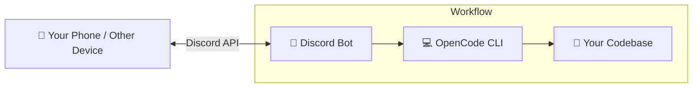

# remote-opencode

> Control your AI coding assistant from anywhere — your phone, tablet, or another computer.

 📦 Used by developers worldwide — **2,000+ weekly downloads** on npm

<div align="center">

</div>

> 🆕 **New in v1.5!** Session management — browse, attach, and manage OpenCode CLI sessions from Discord with `/session`. Plus: model autocomplete for `/model set`. [See changelog](#changelog)
>
> 🎤 **v1.4:** Voice message support — send voice messages that are automatically transcribed and processed. [See demo](#-voice-mode-demo)

**remote-opencode** is a Discord bot that bridges your local [OpenCode CLI](https://github.com/sst/opencode) to Discord, enabling you to interact with your AI coding assistant remotely. Perfect for developers who want to:

- 📱 **Code from mobile** — Send coding tasks from your phone while away from your desk
- 💻 **Access from any device** — Use your powerful dev machine from a laptop or tablet
- 🌍 **Work remotely** — Control your home/office workstation from anywhere
- 👥 **Collaborate** — Share AI coding sessions with team members in Discord
- 🤖 **Automated Workflows** — Queue up multiple tasks and let the bot process them sequentially
- 🎤 **Voice Messages** — Send voice messages that are automatically transcribed and processed as text

## How It Works



The bot runs on your development machine alongside OpenCode. When you send a command via Discord, it's forwarded to OpenCode, and the output streams back to you in real-time.

## Demo

https://github.com/user-attachments/assets/b6239cb6-234e-41e2-a4d1-d4dd3e86c7b9

### 🎤 Voice Mode Demo

https://github.com/user-attachments/assets/59cf162a-ec86-41b5-a1f3-9b1379acd9fd

---

## Table of Contents

- [Installation](#installation)
- [Quick Start](#quick-start)
- [Proxy Support](#proxy-support)
- [Discord Bot Setup](#discord-bot-setup)
- [CLI Commands](#cli-commands)
- [Discord Slash Commands](#discord-slash-commands)
- [Usage Workflow](#usage-workflow)
- [Access Control](#access-control)
- [Configuration](#configuration)
- [Troubleshooting](#troubleshooting)
- [Development](#development)
- [Changelog](#changelog)
- [License](#license)

---

## Installation

### Prerequisites

- **Node.js 22+** — [Download](https://nodejs.org/)
- **OpenCode CLI** — Must be installed and working on your machine
- **Discord Account** — With a server where you have admin permissions

### Install via npm

```bash
# Global installation (recommended)
npm install -g remote-opencode

# Or run directly with npx
npx remote-opencode
```

### Install from source

```bash
git clone https://github.com/RoundTable02/remote-opencode.git
cd remote-opencode
npm install
npm run build
npm link  # Makes 'remote-opencode' available globally
```

---

## Quick Start

```bash
# Step 1: Run the interactive setup wizard
remote-opencode setup

# Step 2: Start the Discord bot
remote-opencode start
```

That's it! Now use Discord slash commands to interact with OpenCode.

---

## Proxy Support

`remote-opencode` supports HTTP proxy environments for Discord and other external API requests.

Supported environment variables:

- `HTTP_PROXY`
- `HTTPS_PROXY`
- `ALL_PROXY`
- `NO_PROXY`

Proxy settings are applied app-wide. Local OpenCode traffic is kept direct automatically, so `localhost`, `127.0.0.1`, and `::1` are always excluded from proxying.

### Example

```bash
export HTTPS_PROXY=http://proxy.company.local:8080
export NO_PROXY=internal.company.local
remote-opencode start
```

If your network uses a single proxy for everything, `ALL_PROXY` is also supported:

```bash
export ALL_PROXY=http://proxy.company.local:8080
remote-opencode start
```

---

## Discord Bot Setup

The setup wizard (`remote-opencode setup`) guides you through the entire process interactively:

1. **Opens Discord Developer Portal** in your browser
2. **Walks you through** creating an application, enabling intents, and getting your bot token
3. **Generates the invite link** automatically and opens it in your browser
4. **Deploys slash commands** to your server

Just run `remote-opencode setup` and follow the prompts — no manual URL copying needed!

<details>
<summary>📖 Manual setup reference (click to expand)</summary>

If you prefer manual setup or need to troubleshoot:

1. **Create Application**: Go to [Discord Developer Portal](https://discord.com/developers/applications), create a new application
2. **Enable Intents**: In "Bot" section, enable SERVER MEMBERS INTENT and MESSAGE CONTENT INTENT
3. **Get Bot Token**: In "Bot" section, reset/view token and copy it
4. **Get Guild ID**: Enable Developer Mode in Discord settings, right-click your server → Copy Server ID
5. **Invite Bot**: Use this URL format:
   ```
   https://discord.com/api/oauth2/authorize?client_id=YOUR_CLIENT_ID&permissions=2147534848&scope=bot+applications.commands
   ```

</details>

---

## CLI Commands

| Command                                 | Description                                          |
| --------------------------------------- | ---------------------------------------------------- |
| `remote-opencode`                       | Start the bot (shows setup guide if not configured)  |
| `remote-opencode setup`                 | Interactive setup wizard — configures bot token, IDs |
| `remote-opencode start`                 | Start the Discord bot                                |
| `remote-opencode deploy`                | Deploy/update slash commands to Discord              |
| `remote-opencode config`                | Display current configuration info                   |
| `remote-opencode allow add <userId>`    | Add a Discord user ID to the allowlist               |
| `remote-opencode allow remove <userId>` | Remove a Discord user ID from the allowlist          |
| `remote-opencode allow list`            | List all user IDs in the allowlist                   |
| `remote-opencode allow reset`           | Clear the entire allowlist (removes access control)  |
| `remote-opencode voice set <apiKey>`    | Set OpenAI API key for voice message transcription   |
| `remote-opencode voice remove`          | Remove the stored OpenAI API key                     |
| `remote-opencode voice status`          | Show voice transcription status and API key source   |

---

## Discord Slash Commands

Once the bot is running, use these commands in your Discord server:

### `/setpath` — Register a Project

Register a local project path with an alias for easy reference.

```
/setpath alias:myapp path:/Users/you/projects/my-app
```

| Parameter | Description                                           |
| --------- | ----------------------------------------------------- |
| `alias`   | Short name for the project (e.g., `myapp`, `backend`) |
| `path`    | Absolute path to the project on your machine          |

### `/projects` — List Registered Projects

View all registered project paths and their aliases.

```
/projects
```

### `/use` — Bind Project to Channel

Set which project a Discord channel should interact with.

```
/use alias:myapp
```

After binding, all `/opencode` commands in that channel will work on the specified project.

### `/opencode` — Send Command to AI

The main command — sends a prompt to OpenCode and streams the response.

```
/opencode prompt:Add a dark mode toggle to the settings page
```

**Features:**

- 🧵 **Auto-creates a thread** for each conversation
- ⚡ **Real-time streaming** — see output as it's generated (1-second updates)
- ⏸️ **Interrupt button** — stop the current task if needed
- 📝 **Session persistence** — continue conversations in the same thread

### `/work` — Create a Git Worktree

Start isolated work on a new branch with its own worktree.

```
/work branch:feature/dark-mode description:Implement dark mode toggle
```

| Parameter     | Description                         |
| ------------- | ----------------------------------- |
| `branch`      | Git branch name (will be sanitized) |
| `description` | Brief description of the work       |

**Features:**

- 🌳 Creates a new git worktree for isolated work
- 🧵 Opens a dedicated thread for the task
- 🗑️ **Delete button** — removes worktree and archives thread
- 🚀 **Create PR button** — automatically creates a pull request

This is perfect for working on multiple features simultaneously without branch switching.

### `/code` — Toggle Passthrough Mode

Enable passthrough mode in a thread to send messages directly to OpenCode without slash commands.

```
/code
```

**How it works:**

1. Run `/code` in any thread to enable passthrough mode
2. Type messages naturally — they're sent directly to OpenCode
3. Run `/code` again to disable

**Example:**

```
You: /code
Bot: ✅ Passthrough mode enabled for this thread.
     Your messages will be sent directly to OpenCode.

You: Add a dark mode toggle to settings
Bot: 📌 Prompt: Add a dark mode toggle to settings
     [streaming response...]

You: Now add a keyboard shortcut for it
Bot: 📌 Prompt: Now add a keyboard shortcut for it
     [streaming response...]

You: /code
Bot: ❌ Passthrough mode disabled.
```

**Features:**

- 📱 **Mobile-friendly** — no more typing slash commands on phone
- 🧵 **Thread-scoped** — only affects the specific thread, not the whole channel
- ⏳ **Busy indicator** — shows ⏳ reaction if previous task is still running
- 🔒 **Safe** — ignores bot messages (no infinite loops)

### `/autowork` — Toggle Automatic Worktree Creation

Enable automatic worktree creation for a project. When enabled, new `/opencode` sessions will automatically create isolated git worktrees.

```
/autowork
```

**How it works:**

1. Run `/autowork` in a channel bound to a project
2. The setting toggles on/off for that project
3. When enabled, new sessions automatically create worktrees with branch names like `auto/abc12345-1738600000000`

**Features:**

- 🌳 **Automatic isolation** — each session gets its own branch and worktree
- 📱 **Mobile-friendly** — no need to type `/work` with branch names
- 🗑️ **Delete button** — removes worktree when done
- 🚀 **Create PR button** — easily create pull requests from worktree
- ⚡ **Per-project setting** — enable/disable independently for each project

### `/queue` — Manage Message Queue

Control the automated job queue for the current thread.

```
/queue list
/queue clear
/queue pause
/queue resume
/queue settings continue_on_failure:True fresh_context:False
```

**How it works:**

1. Send multiple messages to a thread (or use `/opencode` multiple times)
2. If the bot is busy, it reacts with `📥` and adds the task to the queue
3. Once the current job is done, the bot automatically picks up the next one

**Settings:**

- `continue_on_failure`: If `True`, the bot moves to the next task even if the current one fails.
- `fresh_context`: If `True`, the AI forgets previous chat history for each new queued task, starting a fresh session while maintaining the same code state. Default: `False` (conversation context is preserved within the same thread).

### `/diff` — View Git Diff

Show git diffs for the current project directly in Discord — perfect for reviewing AI-made changes from your phone.

```
/diff
/diff target:staged
/diff target:branch base:develop
/diff stat:true
```

| Parameter | Description                                                        |
| --------- | ------------------------------------------------------------------ |
| `target`  | `unstaged` (default), `staged`, or `branch`                       |
| `stat`    | Show `--stat` summary only instead of full diff (default: `false`) |
| `base`    | Base branch for `target:branch` diff (default: `main`)            |

**How it works:**

- Inside a **worktree thread** → diffs the worktree path for that branch
- In a **regular channel** → diffs the channel-bound project path
- Output is formatted in a `diff` code block (truncated if over Discord's 2000-char limit)

**Examples:**

```
/diff                          → unstaged changes (git diff)
/diff target:staged            → staged changes (git diff --cached)
/diff target:branch            → changes vs main (git diff main...HEAD)
/diff target:branch base:dev   → changes vs dev branch
/diff stat:true                → summary only (git diff --stat)
```

---

### `/allow` — Manage Allowlist

Manage the user allowlist directly from Discord. This command is only available when the allowlist has already been initialized (at least one user exists).

```
/allow action:add user:@username
/allow action:remove user:@username
/allow action:list
```

| Parameter | Description                                   |
| --------- | --------------------------------------------- |
| `action`  | `add`, `remove`, or `list`                    |
| `user`    | Target user (required for `add` and `remove`) |

**Behavior:**

- **Requires authorization** — only users already on the allowlist can use this command
- **Cannot remove last user** — prevents accidental lockout
- **Disabled when allowlist is empty** — initial setup must be done via CLI or setup wizard (see [Access Control](#access-control))

---

### `/voice` — Manage Voice Transcription

Manage voice message transcription settings. Requires an OpenAI API key (set via CLI).

```
/voice status               Show voice transcription status
/voice remove               Remove the stored OpenAI API key
```

| Parameter | Description |
| --------- | ----------------------------------------- |
| (none) | Subcommands only: `status`, `remove` |

**How it works:**

1. Set your OpenAI API key via CLI: `remote-opencode voice set <apiKey>`
2. Enable passthrough mode in a thread with `/code`
3. Send a voice message using Discord's 🎤 button
4. The bot adds a 🎙️ reaction, transcribes the audio via OpenAI Whisper, and processes it as a text prompt
5. If the bot is busy, voice messages are queued (with 📥 reaction) and transcribed when dequeued

> **Note:** The `set` subcommand is intentionally CLI-only to avoid API key exposure in Discord command history.

---

### `/model` — List & Set AI Model

View available AI models or set the model for the current channel.

```
/model list
/model set name:anthropic/claude-sonnet-4-20250514
```

| Subcommand | Description                                       |
| ---------- | ------------------------------------------------- |
| `list`     | Show all available models grouped by provider     |
| `set`      | Set the AI model for the current channel/thread   |

**Features:**

- 🔍 **Autocomplete** — start typing a model name and get instant suggestions
- 📋 **Full model list** — all models are shown with automatic message splitting when output exceeds Discord's limit
- 💾 **Per-channel persistence** — model preferences are saved per channel/thread
- ⚡ **Fast validation** — model names are validated against a background-cached list (no blocking CLI calls)

---

### `/default_agent` — Set Default Agent for Project

Set the default agent for a project (channel-bound). This agent will be used for all sessions in that channel unless overridden per-session.

```
/default_agent agent:general-purpose
```

| Parameter | Description                                      |
| --------- | ------------------------------------------------ |
| `agent`   | Agent name (e.g., `general-purpose`, `coder`)   |

**How it works:**

1. Bind a project to a channel with `/use alias:myproject`
2. Set the default agent: `/default_agent agent:general-purpose`
3. All subsequent sessions in that channel will use this agent
4. Can be overridden per-session with `/agent` command

**Priority:**

- **Session agent** (`/agent`) > **Project default agent** (`/default_agent`)

---

### `/agent` — Set Agent for Current Session

Set the agent for the current session/thread. Must be used in a thread with an active session.

```
/agent name:coder
```

| Parameter | Description                                      |
| --------- | ------------------------------------------------ |
| `name`    | Agent name (e.g., `general-purpose`, `coder`)   |

**How it works:**

1. Send a prompt with `/opencode` to start a session
2. Run `/agent name:coder` in the thread
3. The session will use the specified agent
4. This overrides the project's default agent for this session only

**Requirements:**

- Must be used in a thread (not a channel)
- An active session must exist in the thread

**Priority:**

- **Session agent** (`/agent`) > **Project default agent** (`/default_agent`)

---

### `/session` — Browse & Manage Sessions

Browse OpenCode CLI sessions and manage session-thread mappings. Useful for resuming previous conversations or sharing sessions across threads.

```
/session list
/session attach
/session detach
/session info
```

| Subcommand | Description                                                  |
| ---------- | ------------------------------------------------------------ |
| `list`     | List all sessions for the current project (active + mapped)  |
| `attach`   | Attach an existing session to this thread (interactive menu) |
| `detach`   | Disconnect the session from this thread                      |
| `info`     | Show detailed status of the attached session                 |

**How it works:**

1. Use `/session list` to see all sessions for the bound project
2. In a thread, use `/session attach` → select a session from the dropdown
3. The thread now continues that session's conversation (with `freshContext` automatically disabled)
4. Use `/session info` to check if the session is alive, see its port, creation time, etc.
5. Use `/session detach` to disconnect and start fresh

**Features:**

- 📋 **Merged view** — combines active server sessions with persisted thread mappings
- 🔗 **Interactive attach** — dropdown menu shows session title, ID, mapping status, and recency
- ⚠️ **Cross-thread warning** — notifies when attaching a session already used in another thread
- 📊 **Rich info embed** — session status, port, SSE state, timestamps in a clean embed
- 🧹 **Clean detach** — properly disconnects SSE and clears session mapping

---

## Usage Workflow

### Basic Workflow

1. **Register your project:**

   ```
   /setpath alias:webapp path:/home/user/my-webapp
   ```

2. **Bind to a channel:**

   ```
   /use alias:webapp
   ```

3. **Start coding remotely:**

   ```
   /opencode prompt:Refactor the authentication module to use JWT
   ```

4. **Continue the conversation** in the created thread:
   ```
   /opencode prompt:Now add refresh token support
   ```

### Mobile Workflow

Perfect for when you're away from your desk:

1. 📱 Open Discord on your phone
2. Navigate to your bound channel
3. Use `/opencode` to send tasks
4. Watch real-time progress
5. Use the **Interrupt** button if needed

**Pro tip:** Enable passthrough mode with `/code` in a thread for an even smoother mobile experience — just type messages directly without slash commands! You can also send **voice messages** via the 🎤 button — they're automatically transcribed and processed as text.

### Team Collaboration Workflow

Share AI coding sessions with your team:

1. Create a dedicated Discord channel for your project
2. Bind the project: `/use alias:team-project`
3. Team members can watch sessions in real-time
4. Discuss in threads while AI works

### Automated Iteration Workflow

Perfect for "setting and forgetting" several tasks:

1. **Send multiple instructions:**

   ```
   You: Refactor the API
   Bot: [Starts working]
   You: Add documentation to the new methods
   Bot: 📥 [Queued]
   You: Run tests and fix any issues
   Bot: 📥 [Queued]
   ```

2. **The bot will finish the API refactor, then automatically start the documentation task, then run the tests.**

3. **Monitor progress:** Use `/queue list` to see pending tasks.

---

## Access Control

remote-opencode supports an optional **user allowlist** to restrict who can interact with the bot. This is essential when your bot runs in a shared Discord server where untrusted users could otherwise execute commands on your machine.

### How It Works

- **No allowlist configured (default):** All Discord users in the server can use the bot. This preserves backward compatibility for existing installations.
- **Allowlist configured (1+ user IDs):** Only users whose Discord IDs are in the allowlist can use slash commands, buttons, and passthrough messages. Unauthorized users receive a rejection message.

### Setting Up Access Control

> **⚠️ SECURITY WARNING: If your bot operates in a Discord channel accessible to untrusted users, you MUST configure the allowlist before starting the bot. The initial allowlist setup can ONLY be done via the CLI or the setup wizard — NOT from Discord. This prevents unauthorized users from adding themselves to an empty allowlist.**

#### Option 1: Setup Wizard (Recommended for first-time setup)

```bash
remote-opencode setup
```

Step 5 of the wizard prompts you to enter your Discord user ID. This becomes the first entry in the allowlist.

#### Option 2: CLI

```bash
# Add your Discord user ID
remote-opencode allow add 123456789012345678

# Verify
remote-opencode allow list
```

### Managing the Allowlist

Once at least one user is on the allowlist, authorized users can manage it from Discord:

```
/allow action:add user:@teammate
/allow action:remove user:@teammate
/allow action:list
```

Or via CLI at any time:

```bash
remote-opencode allow add <userId>
remote-opencode allow remove <userId>
remote-opencode allow list
remote-opencode allow reset    # Clears entire allowlist (disables access control)
```

### Safety Guardrails

- **Cannot remove the last user** via Discord `/allow` or CLI `allow remove` — prevents accidental lockout
- **`allow reset`** is the only way to fully clear the allowlist (intentional action to disable access control)
- **Discord `/allow` is disabled when allowlist is empty** — prevents bootstrap attacks
- **Config file permissions** are set to `0o600` (owner-read/write only)

---

## Configuration

All configuration is stored in `~/.remote-opencode/`:

| File          | Purpose                                       |
| ------------- | --------------------------------------------- |
| `config.json` | Bot credentials (token, client ID, guild ID)  |
| `data.json`   | Project paths, channel bindings, session data |

### config.json Structure

```json
{
  "discordToken": "your-bot-token",
  "clientId": "your-application-id",
  "guildId": "your-server-id",
  "allowedUserIds": ["123456789012345678"],
  "openaiApiKey": "sk-..."
}
```

> `allowedUserIds` is optional. When omitted or empty, access control is disabled and all users can use the bot.
> `openaiApiKey` is optional. When omitted, voice message transcription is disabled. Can also be set via `OPENAI_API_KEY` environment variable (takes priority).

### data.json Structure

```json
{
  "projects": [
    { "alias": "myapp", "path": "/Users/you/projects/my-app", "autoWorktree": true }
  ],
  "bindings": [
    { "channelId": "channel-id", "projectAlias": "myapp" }
  ],
  "threadSessions": [ ... ],
  "worktreeMappings": [ ... ]
}
```

| Field                     | Description                                               |
| ------------------------- | --------------------------------------------------------- |
| `projects[].autoWorktree` | Optional. When `true`, new sessions auto-create worktrees |

---

## Troubleshooting

### Bot doesn't respond to commands

1. **Check bot is online:** Look for the bot in your server's member list
2. **Verify permissions:** Bot needs these permissions:
   - Send Messages
   - Create Public Threads
   - Send Messages in Threads
   - Embed Links
   - Read Message History
3. **Redeploy commands:**
   ```bash
   remote-opencode deploy
   ```

### "No project set for this channel"

You need to bind a project to the channel:

```
/setpath alias:myproject path:/path/to/project
/use alias:myproject
```

### Commands not appearing in Discord

Slash commands can take up to an hour to propagate globally. For faster updates:

1. Kick the bot from your server
2. Re-invite it
3. Run `remote-opencode deploy`

### OpenCode server errors

1. **Verify OpenCode is installed:**
   ```bash
   opencode --version
   ```
2. **Check if another process is using the port**
3. **Ensure the project path exists and is accessible**

### Session connection issues

The bot maintains persistent sessions. If you encounter issues:

1. Start a new thread with `/opencode` instead of continuing in an old one
2. Restart the bot: `remote-opencode start`

### Bot crashes on startup

1. **Check Node.js version:**
   ```bash
   node --version  # Should be 22+
   ```
2. **Verify configuration:**
   ```bash
   remote-opencode config
   ```
3. **Re-run setup:**
   ```bash
   remote-opencode setup
   ```

### Proxy environments still fail

1. Confirm `HTTP_PROXY`, `HTTPS_PROXY`, or `ALL_PROXY` is set in the same shell where you start the bot
2. Check whether a custom `NO_PROXY` value is excluding a required remote host
3. Leave loopback traffic direct; the bot already auto-adds `localhost`, `127.0.0.1`, and `::1`

---

## Development

### Run from source

```bash
git clone https://github.com/RoundTable02/remote-opencode.git
cd remote-opencode
npm install

# Development mode (with ts-node)
npm run dev setup   # Run setup
npm run dev start   # Start bot

# Build and run production
npm run build
npm start
```

### Run tests

```bash
npm test
```

### Project Structure

```
src/
├── cli.ts                 # CLI entry point
├── bot.ts                 # Discord client initialization
├── commands/              # Slash command definitions
│   ├── opencode.ts        # Main AI interaction command
│   ├── code.ts            # Passthrough mode toggle
│   ├── work.ts            # Worktree management
│   ├── diff.ts            # Git diff viewer
│   ├── model.ts           # AI model list/set with autocomplete
│   ├── session.ts         # Session browsing and management
│   ├── allow.ts           # Allowlist management
│   ├── voice.ts           # Voice transcription settings
│   ├── setpath.ts         # Project registration
│   ├── projects.ts        # List projects
│   └── use.ts             # Channel binding
├── handlers/              # Interaction handlers
│   ├── interactionHandler.ts
│   ├── buttonHandler.ts
│   └── messageHandler.ts  # Passthrough + voice message handling
├── services/              # Core business logic
│   ├── serveManager.ts    # OpenCode process management
│   ├── sessionManager.ts  # Session state management
│   ├── queueManager.ts    # Automated job queuing (incl. voice)
│   ├── executionService.ts # Core prompt execution logic
│   ├── voiceService.ts    # Voice message STT (OpenAI Whisper)
│   ├── sseClient.ts       # Real-time event streaming
│   ├── dataStore.ts       # Persistent storage
│   ├── configStore.ts     # Bot configuration
│   └── worktreeManager.ts # Git worktree operations
├── setup/                 # Setup wizard
│   ├── wizard.ts          # Interactive setup (incl. voice opt-in)
│   └── deploy.ts          # Command deployment
└── utils/                 # Utilities
    ├── messageFormatter.ts
    └── threadHelper.ts
```

---

## Changelog

See [CHANGELOG.md](CHANGELOG.md) for a full history of changes.

### [1.5.1] - 2026-03-24

#### Added

- **Proxy Support**: HTTP proxy environments for Discord requests via `HTTP_PROXY`, `HTTPS_PROXY`, `ALL_PROXY`, and `NO_PROXY`. Local OpenCode traffic is automatically excluded.

#### Fixed

- **Shell Spawn Removed**: OpenCode is now launched directly instead of through a shell, fixing service-environment failures.
- **Silent Error Swallowing**: Discord message edit failures now fall back to sending new messages instead of silently dropping AI responses.
- **Model Provider Prefix**: `/model set` no longer strips the provider prefix, fixing "Model not found" errors. Carriage returns in model names are now sanitized.

### [1.5.0] - 2026-03-16

#### Added

- **`/session` Command**: Browse, attach, detach, and inspect OpenCode CLI sessions from Discord — resume previous conversations or share sessions across threads.
- **Model Autocomplete**: `/model set` now suggests model names as you type.
- **Full Model List**: `/model list` shows all available models without per-provider caps.

#### Changed

- Model validation now uses a fast in-memory cache instead of blocking CLI calls.

### [1.4.0] - 2026-03-10

#### Added

- **Voice Message Transcription**: Send voice messages in `/code` passthrough threads — automatically transcribed via OpenAI Whisper and processed as text prompts.
- **`/voice` Slash Command**: Check status and manage voice transcription settings from Discord.
- **CLI Voice Management**: `remote-opencode voice set|remove|status` commands for managing the OpenAI API key.
- **Setup Wizard Integration**: Optional step to configure voice transcription during initial setup.

### [1.3.0] - 2026-03-02

#### Added

- **`/diff` Command**: View git diffs directly from Discord — ideal for reviewing AI-made changes on mobile.

### [1.2.0] - 2026-02-15

#### Added

- **Owner/Admin Authentication**: User allowlist system to restrict bot access to authorized Discord users only.
- **`/allow` Slash Command**: Manage the allowlist directly from Discord (add, remove, list users).
- **CLI Allowlist Management**: `remote-opencode allow add|remove|list|reset` commands for managing access control from the terminal.
- **Setup Wizard Integration**: Step 5 prompts for owner Discord user ID during initial setup.

#### Security

- Initial allowlist setup is restricted to CLI and setup wizard only — prevents bootstrap attacks from Discord.
- Config file permissions hardened to `0o600` (owner-read/write only).
- Discord user ID validation enforces snowflake format (`/^\d{17,20}$/`).
- Cannot remove the last authorized user via Discord or CLI `remove` — prevents lockout.

### [1.1.0] - 2026-02-05

#### Added

- **Automated Message Queuing**: Added a new system to queue multiple prompts in a thread. If the bot is busy, new messages are automatically queued and processed sequentially.
- **Queue Management**: New `/queue` slash command suite to list, clear, pause, resume, and configure queue settings.

### [1.0.10] - 2026-02-04

#### Added

- New `/setports` slash command to configure the port range for OpenCode server instances.

#### Fixed

- Fixed Windows-specific spawning issue (targeting `opencode.cmd`).
- Resolved `spawn EINVAL` errors on Windows.
- Improved server reliability and suppressed `DEP0190` security warnings.

### [1.0.9] - 2026-02-04

#### Added

- New `/model` slash command to set AI models per channel.
- Support for `--model` flag in OpenCode server instances.

#### Fixed

- Fixed connection timeout issues.
- Standardized internal communication to use `127.0.0.1`.

---

## License

MIT

---

## Contributing

Contributions are welcome! Please read our [Contributing Guide](CONTRIBUTING.md) before submitting a Pull Request.
